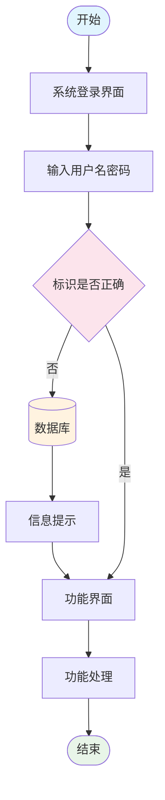
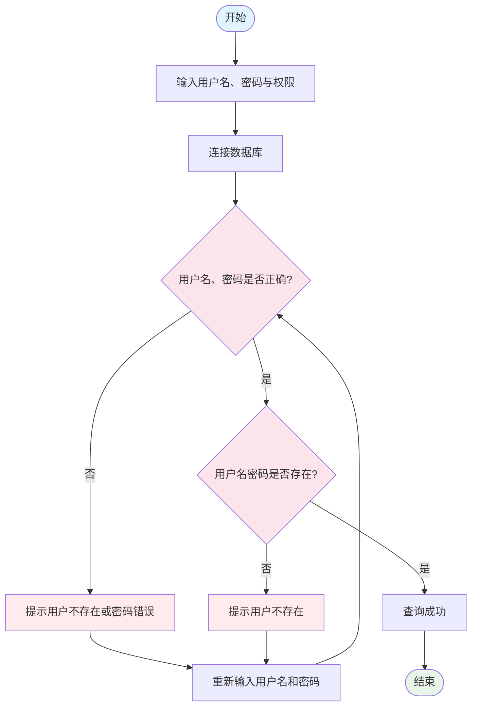
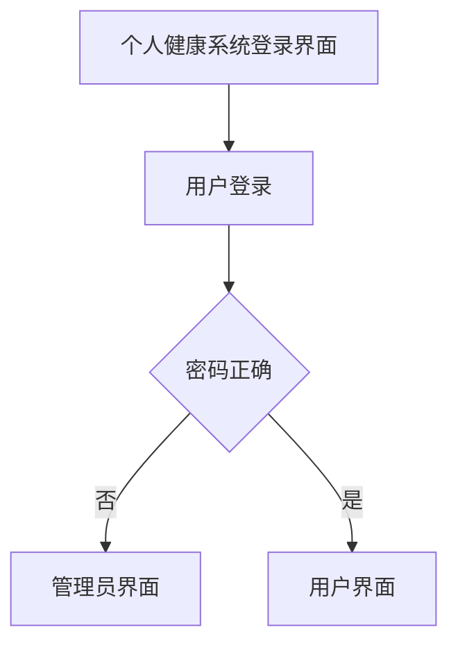
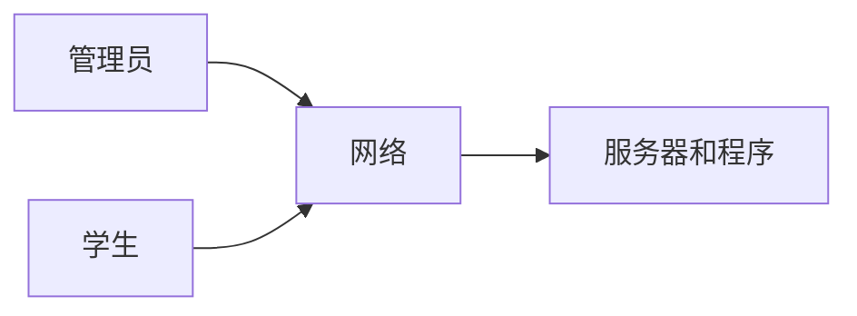
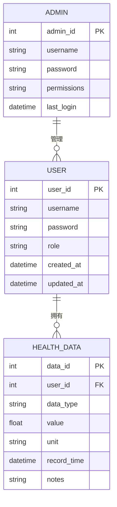

# 个人健康管理系统设计文档

## 1. 项目概述

个人健康管理系统是一个面向个人用户和管理员的健康数据管理平台，提供健康数据录入、查询、分析等功能。

## 2. 系统流程设计

### 2.1 系统主流程



### 2.2 用户登录验证流程



### 2.3 个人健康系统登录界面流程



## 3. 系统架构设计

### 3.1 系统整体架构



### 3.2 用户角色关系图



## 4. 功能模块设计

### 4.1 前端界面功能需求

基于UI设计稿，系统需要实现以下核心功能模块：

#### 4.1.1 用户认证模块
- **登录界面**：简洁的用户登录页面，支持用户名/密码认证
- **注册功能**：新用户注册流程
- **权限控制**：基于角色的访问控制（管理员/普通用户）

#### 4.1.2 健康数据管理模块
- **身体信息管理**：用户基本信息录入和编辑（身高、体重、年龄等）
- **健康数据录入**：支持多种健康指标的数据输入
- **体检图片上传**：支持医疗报告、体检图片的上传和管理
- **数据可视化**：健康变化曲线图，展示历史趋势

#### 4.1.3 智能健康助手
- **AI对话界面**：智能健康咨询和建议系统
- **健康评估**：基于用户数据的智能健康评估
- **个性化建议**：根据用户情况提供定制化健康建议

#### 4.1.4 运动知识库
- **知识管理**：运动知识的增删改查功能
- **知识浏览**：分类浏览运动相关知识和指导
- **运动详情**：详细的运动记录和分析
- **运动计划**：个性化运动计划制定和跟踪

#### 4.1.5 系统管理模块
- **用户管理**：管理员用户账户管理功能
- **角色管理**：系统角色和权限配置
- **数据统计**：系统使用情况和数据统计
- **系统配置**：基础系统参数配置

### 4.2 前端技术要求

#### 4.2.1 界面设计规范
- **响应式设计**：支持桌面端和移动端适配
- **现代化UI**：采用Material Design或类似设计语言
- **深色侧边栏**：统一的导航栏设计风格
- **数据可视化**：集成图表库（如ECharts、Chart.js）
- **主题兼容性**：前端架构需预留深色/浅色主题切换能力，便于未来扩展

#### 4.2.2 交互体验
- **实时数据更新**：支持数据的实时刷新和同步
- **文件上传**：拖拽上传、进度显示、格式验证
- **表单验证**：前端数据验证和错误提示
- **加载状态**：操作反馈和加载动画
- **主题适配**：UI组件需支持CSS变量，为未来深色模式做准备

#### 4.2.3界面语言
- **英文为主**：实际代码和用户界面应当采用英文界面. 即使开发中和AI IDE交流使用中文为主. 在系统内部和数据库存储中, 所有数据都应当采用英文. 

### 4.3 主要功能模块（后端）

- **用户管理模块**：负责用户注册、登录、权限管理
- **健康数据管理模块**：健康数据的录入、存储、查询
- **数据分析模块**：对健康数据进行统计分析. 考虑包含预留AI API功能, 用于未来扩展智能分析功能.
- **系统管理模块**：系统配置、日志管理等

### 4.4 用户权限设计

系统支持两种用户角色：
- **管理员**：拥有系统全部权限，可以管理用户、查看所有数据、管理运动知识库
- **普通用户**：只能管理自己的健康数据、使用AI助手、浏览运动知识

## 5. 数据库设计

### 5.1 用户表设计

| 字段名 | 数据类型 | 说明 | 约束 |
|--------|----------|------|------|
| user_id | INT | 用户ID | 主键，自增 |
| username | VARCHAR(50) | 用户名 | 唯一，非空 |
| password | VARCHAR(255) | 密码 | 非空 |
| role | VARCHAR(20) | 用户角色 | 默认'user' |
| created_at | TIMESTAMP | 创建时间 | 默认当前时间 |

### 5.2 健康数据表设计

| 字段名 | 数据类型 | 说明 | 约束 |
|--------|----------|------|------|
| data_id | INT | 数据ID | 主键，自增 |
| user_id | INT | 用户ID | 外键，非空 |
| data_type | VARCHAR(50) | 数据类型 | 非空（如：血压、体重、血糖等） |
| value | DECIMAL(10,2) | 数值 | 非空 |
| unit | VARCHAR(20) | 单位 | 非空 |
| record_time | TIMESTAMP | 记录时间 | 默认当前时间 |
| notes | TEXT | 备注 | 可空 |

### 5.3 管理员表设计

| 字段名 | 数据类型 | 说明 | 约束 |
|--------|----------|------|------|
| admin_id | INT | 管理员ID | 主键，自增 |
| username | VARCHAR(50) | 管理员用户名 | 唯一，非空 |
| password | VARCHAR(255) | 密码 | 非空 |
| permissions | VARCHAR(255) | 权限列表 | 非空 |
| last_login | TIMESTAMP | 最后登录时间 | 可空 |

## 6. 技术实现

### 6.1 技术栈

#### 6.1.1 微服务架构概览
- **架构模式**：微服务架构
- **服务注册与发现**：Eureka Server
- **API网关**：Spring Cloud Gateway
- **配置中心**：Spring Cloud Config（可选）
- **前端**：Vue.js 3 + TypeScript + Element Plus UI框架
- **数据库**：H2数据库（持久化模式）+ Spring Profile支持MySQL扩展
- **容器化**：Docker + Docker Compose
- **缓存**：Redis（可选）

#### 6.1.2 Spring Boot依赖库清单

##### **1. 服务注册中心 (Eureka Server)**
```xml
<dependencies>
    <!-- Spring Boot Starter -->
    <dependency>
        <groupId>org.springframework.boot</groupId>
        <artifactId>spring-boot-starter</artifactId>
    </dependency>
    
    <!-- Eureka Server -->
    <dependency>
        <groupId>org.springframework.cloud</groupId>
        <artifactId>spring-cloud-starter-netflix-eureka-server</artifactId>
    </dependency>
    
    <!-- Spring Boot Actuator -->
    <dependency>
        <groupId>org.springframework.boot</groupId>
        <artifactId>spring-boot-starter-actuator</artifactId>
    </dependency>
</dependencies>
```

##### **2. API网关服务 (Spring Cloud Gateway)**
```xml
<dependencies>
    <!-- Spring Cloud Gateway -->
    <dependency>
        <groupId>org.springframework.cloud</groupId>
        <artifactId>spring-cloud-starter-gateway</artifactId>
    </dependency>
    
    <!-- Eureka Client -->
    <dependency>
        <groupId>org.springframework.cloud</groupId>
        <artifactId>spring-cloud-starter-netflix-eureka-client</artifactId>
    </dependency>
    
    <!-- Spring Boot Actuator -->
    <dependency>
        <groupId>org.springframework.boot</groupId>
        <artifactId>spring-boot-starter-actuator</artifactId>
    </dependency>
    
    <!-- Load Balancer -->
    <dependency>
        <groupId>org.springframework.cloud</groupId>
        <artifactId>spring-cloud-starter-loadbalancer</artifactId>
    </dependency>
</dependencies>
```

##### **3. 用户服务 (User Service)**
```xml
<dependencies>
    <!-- Spring Boot Web -->
    <dependency>
        <groupId>org.springframework.boot</groupId>
        <artifactId>spring-boot-starter-web</artifactId>
    </dependency>
    
    <!-- Spring Data JPA -->
    <dependency>
        <groupId>org.springframework.boot</groupId>
        <artifactId>spring-boot-starter-data-jpa</artifactId>
    </dependency>
    
    <!-- Spring Security -->
    <dependency>
        <groupId>org.springframework.boot</groupId>
        <artifactId>spring-boot-starter-security</artifactId>
    </dependency>
    
    <!-- H2 Database -->
    <dependency>
        <groupId>com.h2database</groupId>
        <artifactId>h2</artifactId>
        <scope>runtime</scope>
    </dependency>
    
    <!-- MySQL Connector (可选) -->
    <dependency>
        <groupId>mysql</groupId>
        <artifactId>mysql-connector-java</artifactId>
        <scope>runtime</scope>
    </dependency>
    
    <!-- Eureka Client -->
    <dependency>
        <groupId>org.springframework.cloud</groupId>
        <artifactId>spring-cloud-starter-netflix-eureka-client</artifactId>
    </dependency>
    
    <!-- Validation -->
    <dependency>
        <groupId>org.springframework.boot</groupId>
        <artifactId>spring-boot-starter-validation</artifactId>
    </dependency>
    
    <!-- JWT -->
    <dependency>
        <groupId>io.jsonwebtoken</groupId>
        <artifactId>jjwt-api</artifactId>
        <version>0.11.5</version>
    </dependency>
    <dependency>
        <groupId>io.jsonwebtoken</groupId>
        <artifactId>jjwt-impl</artifactId>
        <version>0.11.5</version>
        <scope>runtime</scope>
    </dependency>
    <dependency>
        <groupId>io.jsonwebtoken</groupId>
        <artifactId>jjwt-jackson</artifactId>
        <version>0.11.5</version>
        <scope>runtime</scope>
    </dependency>
</dependencies>
```

##### **4. 健康数据服务 (Health Service)**
```xml
<dependencies>
    <!-- Spring Boot Web -->
    <dependency>
        <groupId>org.springframework.boot</groupId>
        <artifactId>spring-boot-starter-web</artifactId>
    </dependency>
    
    <!-- Spring Data JPA -->
    <dependency>
        <groupId>org.springframework.boot</groupId>
        <artifactId>spring-boot-starter-data-jpa</artifactId>
    </dependency>
    
    <!-- H2 Database -->
    <dependency>
        <groupId>com.h2database</groupId>
        <artifactId>h2</artifactId>
        <scope>runtime</scope>
    </dependency>
    
    <!-- Eureka Client -->
    <dependency>
        <groupId>org.springframework.cloud</groupId>
        <artifactId>spring-cloud-starter-netflix-eureka-client</artifactId>
    </dependency>
    
    <!-- OpenFeign (服务间调用) -->
    <dependency>
        <groupId>org.springframework.cloud</groupId>
        <artifactId>spring-cloud-starter-openfeign</artifactId>
    </dependency>
    
    <!-- Validation -->
    <dependency>
        <groupId>org.springframework.boot</groupId>
        <artifactId>spring-boot-starter-validation</artifactId>
    </dependency>
</dependencies>
```

##### **5. AI服务 (AI Service)**
```xml
<dependencies>
    <!-- Spring Boot Web -->
    <dependency>
        <groupId>org.springframework.boot</groupId>
        <artifactId>spring-boot-starter-web</artifactId>
    </dependency>
    
    <!-- Eureka Client -->
    <dependency>
        <groupId>org.springframework.cloud</groupId>
        <artifactId>spring-cloud-starter-netflix-eureka-client</artifactId>
    </dependency>
    
    <!-- OpenFeign -->
    <dependency>
        <groupId>org.springframework.cloud</groupId>
        <artifactId>spring-cloud-starter-openfeign</artifactId>
    </dependency>
    
    <!-- HTTP Client (调用外部AI API) -->
    <dependency>
        <groupId>org.springframework.boot</groupId>
        <artifactId>spring-boot-starter-webflux</artifactId>
    </dependency>
    
    <!-- JSON Processing -->
    <dependency>
        <groupId>com.fasterxml.jackson.core</groupId>
        <artifactId>jackson-databind</artifactId>
    </dependency>
</dependencies>
```

##### **6. 知识库服务 (Knowledge Service)**
```xml
<dependencies>
    <!-- Spring Boot Web -->
    <dependency>
        <groupId>org.springframework.boot</groupId>
        <artifactId>spring-boot-starter-web</artifactId>
    </dependency>
    
    <!-- Spring Data JPA -->
    <dependency>
        <groupId>org.springframework.boot</groupId>
        <artifactId>spring-boot-starter-data-jpa</artifactId>
    </dependency>
    
    <!-- H2 Database -->
    <dependency>
        <groupId>com.h2database</groupId>
        <artifactId>h2</artifactId>
        <scope>runtime</scope>
    </dependency>
    
    <!-- Eureka Client -->
    <dependency>
        <groupId>org.springframework.cloud</groupId>
        <artifactId>spring-cloud-starter-netflix-eureka-client</artifactId>
    </dependency>
    
    <!-- File Upload -->
    <dependency>
        <groupId>commons-fileupload</groupId>
        <artifactId>commons-fileupload</artifactId>
        <version>1.4</version>
    </dependency>
    
    <!-- Validation -->
    <dependency>
        <groupId>org.springframework.boot</groupId>
        <artifactId>spring-boot-starter-validation</artifactId>
    </dependency>
</dependencies>
```

##### **7. 公共依赖管理 (Parent POM)**
```xml
<parent>
    <groupId>org.springframework.boot</groupId>
    <artifactId>spring-boot-starter-parent</artifactId>
    <version>2.7.14</version>
    <relativePath/>
</parent>

<properties>
    <java.version>17</java.version>
    <spring-cloud.version>2021.0.8</spring-cloud.version>
</properties>

<dependencyManagement>
    <dependencies>
        <dependency>
            <groupId>org.springframework.cloud</groupId>
            <artifactId>spring-cloud-dependencies</artifactId>
            <version>${spring-cloud.version}</version>
            <type>pom</type>
            <scope>import</scope>
        </dependency>
    </dependencies>
</dependencyManagement>
```

#### 6.1.3 版本兼容性说明
- **Spring Boot**: 2.7.14 (LTS版本)
- **Spring Cloud**: 2021.0.8 (对应Spring Boot 2.7.x)
- **Java**: 17 (推荐) 或 11
- **Maven**: 3.6+ 或 Gradle 7+

### 6.2 数据库选择说明

#### 项目数据库策略（学生演示项目）

考虑到本项目为学生演示项目，采用以下数据库策略：

| 环境类型 | 使用数据库 | 配置说明 | 适用场景 |
|----------|------------|----------|----------|
| **开发环境** | H2数据库（持久化） | 文件模式存储，快速启动 | 日常开发和调试 |
| **演示环境** | H2数据库（持久化） | 内嵌模式，便于部署演示 | 课程演示和答辩 |
| **扩展选项** | MySQL/PostgreSQL | 通过Spring Profile切换 | 未来扩展或学习需要 |

#### H2数据库配置

**持久化配置**：
- 数据存储：`./data/healthdb`（文件模式）
- 控制台访问：`http://localhost:8080/h2-console`
- 连接字符串：`jdbc:h2:file:./data/healthdb;AUTO_SERVER=TRUE`

**Spring Profile支持**：
- `application-dev.yml`：H2开发配置
- `application-demo.yml`：H2演示配置  
- `application-mysql.yml`：MySQL扩展配置

💡 **项目优势**：
- ✅ 零配置启动，适合演示
- ✅ 数据持久化，支持重启
- ✅ 保留扩展能力，便于学习
- ✅ 轻量级部署，易于分发

### 6.3 安全设计

- 密码加密存储
- 用户会话管理
- 输入数据验证
- SQL注入防护

## 7. 部署说明

### 7.1 环境要求

- **操作系统**：Windows/Linux/macOS
- **Java环境**：JDK 11+ 或 JDK 17+
- **Node.js环境**：Node.js 16+ + npm/yarn
- **数据库**：H2数据库（内置，无需额外安装）
- **Web服务器**：Nginx 1.16+（可选，用于生产部署）

### 7.2 快速启动（开发模式）

1. **后端启动**：
   ```bash
   cd backend
   ./mvnw spring-boot:run
   ```

2. **前端启动**：
   ```bash
   cd frontend
   npm install
   npm run dev
   ```

3. **访问系统**：
   - 前端界面：`http://localhost:3000`
   - H2控制台：`http://localhost:8080/h2-console`
   - API接口：`http://localhost:8080/api`

### 7.3 Docker部署策略

#### 7.3.1 早期开发阶段
- **前端**：本地开发服务器 (`npm run dev`)
- **后端**：本地Spring Boot运行 (`./mvnw spring-boot:run`)
- **优势**：快速开发调试，热重载支持

#### 7.3.2 后期演示阶段

**方案一：简化部署（推荐）**
```bash
# 前端构建为静态文件
cd frontend && npm run build

# 后端容器化
cd backend && ./mvnw clean package
docker build -t health-backend .
docker run -p 8080:8080 health-backend

# 前端用Nginx托管静态文件
```

**方案二：完整容器化**
```yaml
# docker-compose.yml
services:
  frontend:
    build: ./frontend
    ports:
      - "3000:80"
  backend:
    build: ./backend
    ports:
      - "8080:8080"
    environment:
      - SPRING_PROFILES_ACTIVE=demo
```

**一键启动**：
```bash
docker-compose up -d
```

#### 7.3.3 端口自动暴露
- **Docker自动处理**：通过 `-p` 参数或 docker-compose 配置
- **后端API**：`localhost:8080/api`
- **前端界面**：`localhost:3000`
- **H2控制台**：`localhost:8080/h2-console`

#### 7.3.4 数据初始化
- 系统首次启动自动创建数据库表
- 默认管理员账户：admin/admin123
- 演示数据自动导入